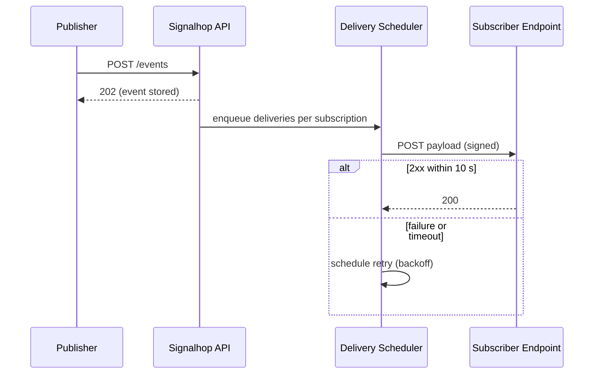

# Architecture Documentation Rules

## Purpose

Document the product architecture clearly enough for architects, developers, and platform teams to understand system behavior.

## Required architecture topics

- System context
- Component responsibilities
- Runtime flow
- Data flow
- Integration points
- Security model
- Deployment model when known
- Failure handling
- Observability
- Scalability considerations
- Technical decisions
- Known limitations

## Component table

```md
| Component | Responsibility | Inputs | Outputs | Dependencies | Failure Mode |
|---|---|---|---|---|---|
```

## Runtime flow format

```md
## Runtime Flow

1. The request enters through ...
2. The system validates ...
3. The orchestration layer ...
4. The component ...
5. The response is returned ...
```

## Diagrams

Produce diagrams, do not merely recommend them. For any architecture document, generate Mermaid source for at least the runtime flow (sequence diagram) and the component relationships (flowchart); add data-flow, deployment, or state diagrams when the product calls for them.



Rules:

- Keep the Mermaid source in the Markdown next to the section it illustrates, so it stays editable and diffable.
- A diagram shows what prose states; the surrounding text must still describe the flow. Readers of formats that strip diagrams lose nothing essential.
- For output formats that cannot render Mermaid (DOCX, PDF), render to PNG/SVG during Phase 10 — `output-formats/SKILL.md` covers the tooling.
- Do not claim that a diagram exists unless it was provided or generated, and do not diagram architecture the user never described: a diagram of an assumed design is an assumption and must be labeled as one.
